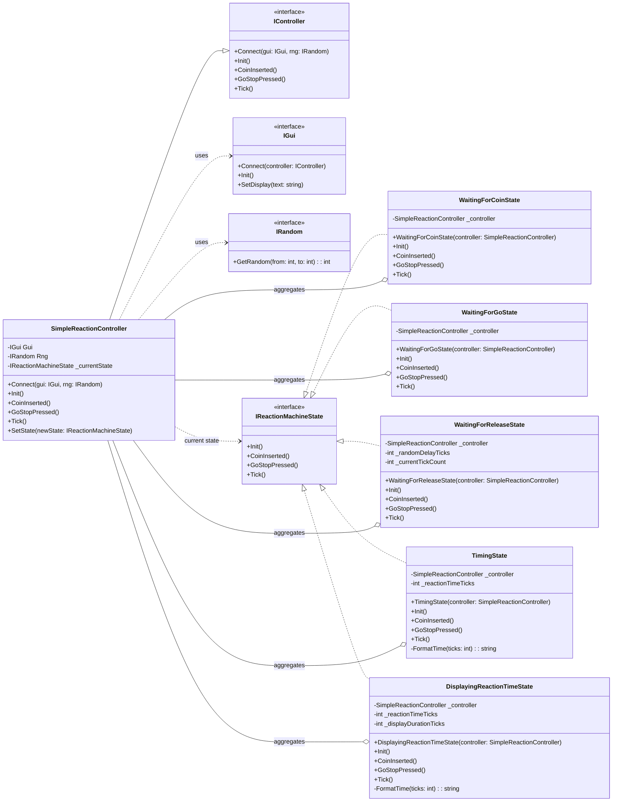
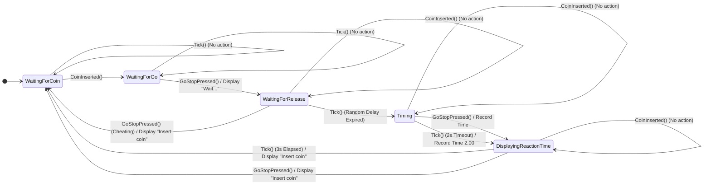

# Visual UML Diagram for Simple Reaction Machine

## Class Diagram

This diagram illustrates the main classes and interfaces involved in the Simple Reaction Machine, focusing on the State Design Pattern.

## State Diagram

This diagram visualizes the states and transitions of the Simple Reaction Machine's behavior.

